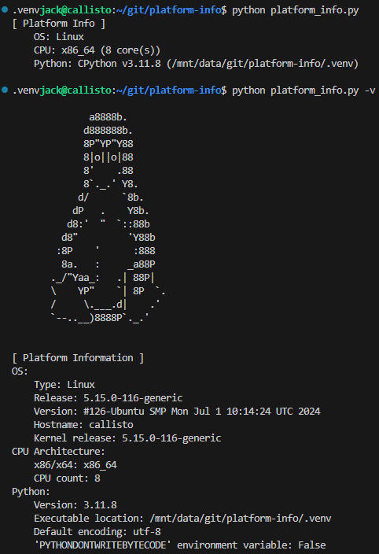
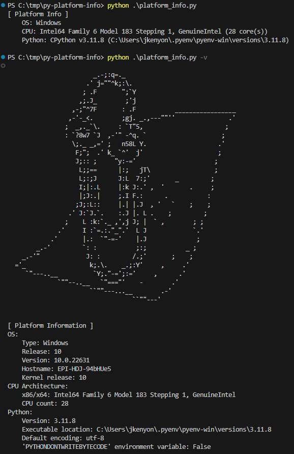

# Platform Info Script

This script compiles platform information from the system running it. The final output of the script is a `PlatformInfo()` class object, with properties set to data about the host system. This includes information about the OS itself (type, i.e. "Windows", "Linux", "Mac"), Python (implementation, version, executable path), CPU (architecture, core count, etc), and more.

## Requirements

None! This module only uses the Python `stdlib`.

For development, you can optionally install dependencies like `ruff`, `pytest`, etc using the [`requirements.txt`](./requirements.txt) file: `pip install -r requirements.txt`.

## Usage

This script includes a CLI interface built with [`argparse`](https://docs.python.org/3/library/argparse.html). To see a list of available options, run `python platform_info.py --help`.

The CLI allows for multiple verbosity levels (capped at 2, i.e. `-vv`). For each level of verbosity, more system information is printed; to print the full `PlatformInfo()` object, run the script with `-d/--debug`, i.e. `python platform_info.py -d`.

This script can also be run as a module: `python -m platform_info --help`

### Tests

Unit tests are in the [`tests/`](./tests) directory. They can be run with `nox` (included in `requirements.txt`) with: `nox -s tests`.

To run the tests manually:

- Create a virtual environment with `virtualenv .venv`
- Activate the environment:
  - Windows: `. .\.venv\Scripts\activate`
  - Linux/Mac: `. ./.venv/bin/activate`
- Install the dependencies with `pip install -r requirements.txt`
- Run the tests with: `pytest -n auto --tb=auto -v -rsXxfP`

## Examples

### Linux

### Windows

